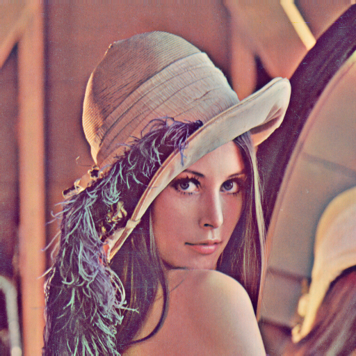
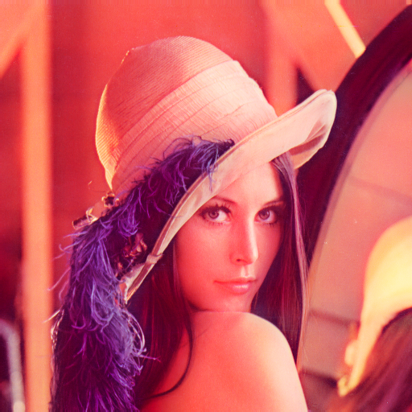
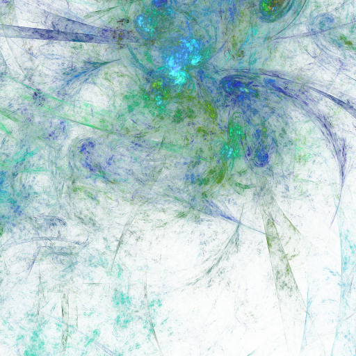
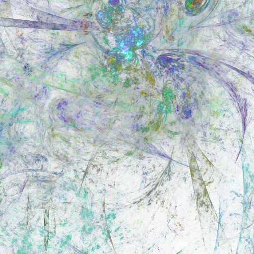
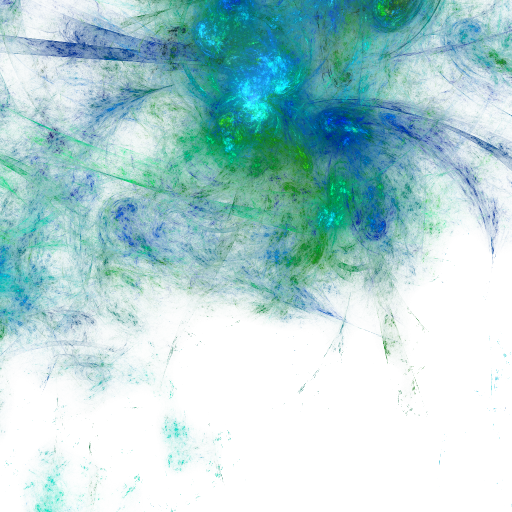

# stbibalance-examples

Examples [Balance filter](https://github.com/ImageProcessing-ElectronicPublications/stbibalance) based of Gauss blur.

This filter was first applied in [STEX](https://github.com/ImageProcessing-ElectronicPublications/scantailor-experimental) (2024)
in a single-component version (Y, the values of the color components were aligned
in accordance with the brightness values before and after the filter).

Here this filter is implemented in a full-color version.

## Example 1

| Image | components | description | params |
| --- | --- | --- | --- |
|  | 3 | oigin | - |
|  | 3 | Balance filter | defaults: `-s 10.0 -m 1.0` |
|  | 3 | deBalance filter | `-s 10.0 -m -1.0` |

## Example 2

| Image | components | description | params |
| --- | --- | --- | --- |
|  | 4 | oigin | - |
|  | 4 | Balance filter | defaults: `-s 10.0 -m 1.0` |
|  | 4 | deBalance filter | `-s 10.0 -m -1.0` |

## Links

* STB: [stb](https://github.com/nothings/stb).
* Gauss blur: [iir_gauss_blur](https://github.com/arkanis/iir_gauss_blur).
* Balance filter: [stbibalance](https://github.com/ImageProcessing-ElectronicPublications/stbibalance).
